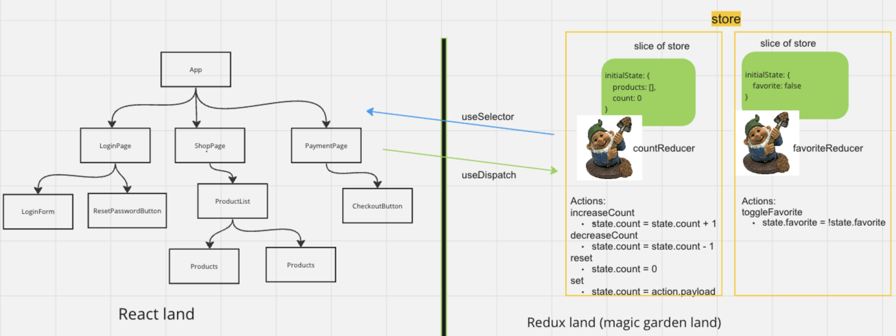

# Getting Started with Create React App

This project was bootstrapped with [Create React App](https://github.com/facebook/create-react-app).

## Setup
- Git clone this repo
- Run `npm install` to install all the dependencies listed in package.json
- Run `npm run start` to start the local development server

## React land vs Redux magic garden land

## Redux things to set up
1. `npm install @reduxjs/toolkit react-redux`
1. In src, create `store` folder with `index.js `in it
1. In `src/store/index.js`, create an empty store
1. In `src/index.js`, provide the store to your App component
1. Create slices in new folder, `src/store/{yourSliceName}` with a `slice.js` file in it
1. Set up your slice with `initialState` and empty actions
1. Run your app and open the Redux dev tools to make sure you set up your slices and initial state correctly
1. Add some logic to your actions and export them
1. In your UI components, import your actions and use the `useDispatch` hook to dispatch them
1. Check if you can see the actions in the Redux dev tools
1. Create a `selectors.js` file in `src/store/{yourSliceName}`, create a selectors function, and export it
1. In your UI components, import the selector you just created, and use it with the `useSelector` hook